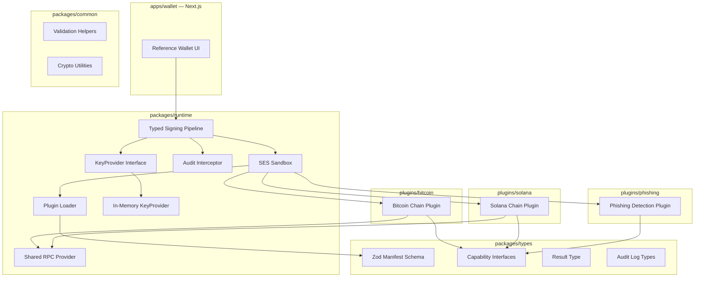
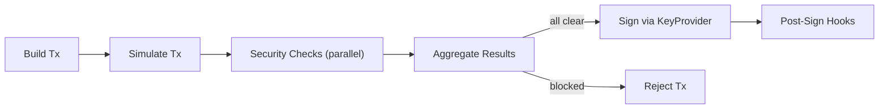

# Ea

**Chain-agnostic sandboxed plugin runtime for wallets.**

Ea is a TypeScript monorepo that provides a secure, extensible foundation for building multi-chain wallets. Plugins run in isolated [SES](https://github.com/endojs/endo/tree/master/packages/ses) compartments, communicate through typed capability interfaces, and are gated by a signing pipeline with built-in audit logging and security checks.

---

## Architecture



---

## Repository Structure

```
ea/
├── packages/
│   ├── types/          # @ea/types    — Result<T,E>, error taxonomy, Zod manifests, capability interfaces
│   ├── runtime/        # @ea/runtime  — sandbox, loader, signing pipeline, RPC provider, KeyProvider
│   └── common/         # @ea/common   — validation helpers, timeout wrapper, structured logger
├── plugins/
│   ├── bitcoin/        # @ea/plugin-bitcoin   — BIP32/44/84, P2WPKH, Esplora simulation
│   ├── solana/         # @ea/plugin-solana    — SOL/SPL transfers, RPC simulation
│   └── phishing/       # @ea/plugin-phishing  — threat list + heuristic security checks
├── apps/
│   └── wallet/         # Next.js reference wallet
├── turbo.json
├── pnpm-workspace.yaml
├── tsconfig.base.json
└── vitest.config.ts
```

---

## Getting Started

**Prerequisites:** Node.js >= 20 LTS, pnpm >= 9

```bash
# Install all workspace dependencies
pnpm install

# Build all packages
pnpm build

# Run all tests
pnpm test

# Lint
pnpm lint

# Format
pnpm format
```

Individual packages can be developed in watch mode:

```bash
# Example: watch-rebuild @ea/types
cd packages/types
pnpm dev
```

---

## Packages

### `@ea/types`

Core type definitions shared across the entire runtime:

- **`Result<T, E>`** — explicit success/failure discriminated union, no thrown exceptions
- **Error taxonomy** — `SandboxError`, `PermissionError`, `NetworkError`, `ValidationError`, `TimeoutError`, `SecurityBlockError`
- **Zod manifest schema** — single source of truth for plugin manifests: `id`, `version`, `type`, `permissions`, `endowments`, `supportedChains`, `capabilities`
- **Capability interfaces** — `AccountProvider`, `TransactionBuilder`, `TransactionSimulator`, `TransactionSigner`, `SecurityPlugin`
- **Audit log types** — `AuditEntry` with plugin ID, operation, stage, sanitized I/O, duration, and outcome

### `@ea/runtime`

The core execution engine:

- **Plugin Loader** — validates manifests via Zod, manages a plugin registry, loads chain/security plugins eagerly and utility plugins lazily
- **SES Sandbox** — each plugin runs in a persistent `@endo/compartment` with scoped endowments only (`fetch` via RPC provider, filtered `console`, `crypto.getRandomValues`); no direct access to globals
- **Typed Signing Pipeline** — `BuildTx → Simulate → Security Checks (parallel) → Sign → Post-Sign`; every stage is typed, audited, and time-bounded
- **KeyProvider** — pluggable interface; default in-memory implementation stores seeds encrypted with AES-256-GCM; plugins never receive a `KeyProvider` reference directly
- **Shared RPC Provider** — connection pooling, 15-second TTL cache for state queries, per-endpoint token bucket rate limiting

### `@ea/common`

Shared utilities with no runtime dependencies:

- Zod schema runners returning `Result`
- `withTimeout<T>(promise, ms)` wrapping async calls in `TimeoutError`
- Structured logger interface
- Address validation and encoding helpers

---

## Plugins

### `@ea/plugin-bitcoin`

Implements `AccountProvider`, `TransactionBuilder`, `TransactionSimulator`.

- HD key derivation via BIP32/44/84 (`bitcoinjs-lib`)
- P2WPKH transaction construction
- Fee estimation and simulation via Electrum/Esplora-compatible RPC

### `@ea/plugin-solana`

Implements `AccountProvider`, `TransactionBuilder`, `TransactionSimulator`.

- SOL transfers and SPL token transfers (`@solana/web3.js`)
- Simulation via Solana RPC `simulateTransaction`; returns decoded balance changes and fees

### `@ea/plugin-phishing`

Implements `SecurityPlugin`.

- `onPreSign` checks the destination address against a bundled threat list and heuristic patterns
- Returns `SecurityCheckResult` with `action: 'warn' | 'block'` and a human-readable reason
- A `block` result halts the pipeline and prevents signing

---

## Signing Pipeline



- Security plugins run in parallel via `Promise.allSettled`; a crash in one does not cancel others
- If any plugin returns `action: 'block'`, the pipeline returns `SecurityBlockError` immediately
- Warnings are aggregated and surfaced to the UI for user review
- Default timeouts: 3s for simulation, 2s per security plugin
- Every stage is wrapped by an audit interceptor that logs input, output, duration, and result

---

## Security Model

| Boundary         | Mechanism                                                                                                        |
| ---------------- | ---------------------------------------------------------------------------------------------------------------- |
| Plugin isolation | SES `Compartment` — no shared globals, no prototype access                                                       |
| Key material     | `KeyProvider` never passed to plugins; plugins call `requestSigning` endowment which routes through the pipeline |
| Network access   | Scoped `fetch` endowment via `RpcProvider`; no arbitrary outbound requests                                       |
| Permissions      | Declared in manifest, enforced at every capability call                                                          |
| Audit            | Every signing attempt and plugin call is logged to an append-only `AuditEntry` store                             |

The test suite includes adversarial sandbox escape attempts covering `process` access, prototype pollution, constructor chain escapes, dynamic import, `eval`/`Function`, infinite loops, memory bombs, and endowment boundary violations.

---

## Toolchain

| Tool                                         | Purpose                                                                |
| -------------------------------------------- | ---------------------------------------------------------------------- |
| [pnpm](https://pnpm.io)                      | Package manager + workspaces                                           |
| [Turborepo](https://turbo.build)             | Monorepo build orchestration with caching                              |
| [TypeScript](https://www.typescriptlang.org) | Strict mode (`noUncheckedIndexedAccess`, `exactOptionalPropertyTypes`) |
| [Vitest](https://vitest.dev)                 | Fast, native ESM test runner                                           |
| [ESLint](https://eslint.org)                 | Static analysis with `@typescript-eslint`                              |
| [Prettier](https://prettier.io)              | Consistent code formatting                                             |
| [Zod](https://zod.dev)                       | Runtime schema validation with inferred TypeScript types               |
| [@endo/ses](https://github.com/endojs/endo)  | Hardened JavaScript compartments                                       |

---

## Roadmap

| Phase                   | Status      | Scope                                                                                     |
| ----------------------- | ----------- | ----------------------------------------------------------------------------------------- |
| 0 — Monorepo Skeleton   | In Progress | Workspace setup, `@ea/types`, `@ea/common`                                                |
| 1 — Core Runtime        | Pending     | Plugin loader, SES sandbox, KeyProvider, signing pipeline, RPC provider                   |
| 2 — Chain Plugins       | Pending     | Bitcoin, Solana, phishing detection                                                       |
| 3 — Reference Wallet    | Pending     | Next.js UI: send flow, simulation confirmation, plugin management, audit log              |
| 4 — Testing & Hardening | Pending     | Adversarial sandbox tests, pipeline edge cases, chain plugin test pyramid, Playwright E2E |

---

## License

Private — part of the Ordinal Scale project.
